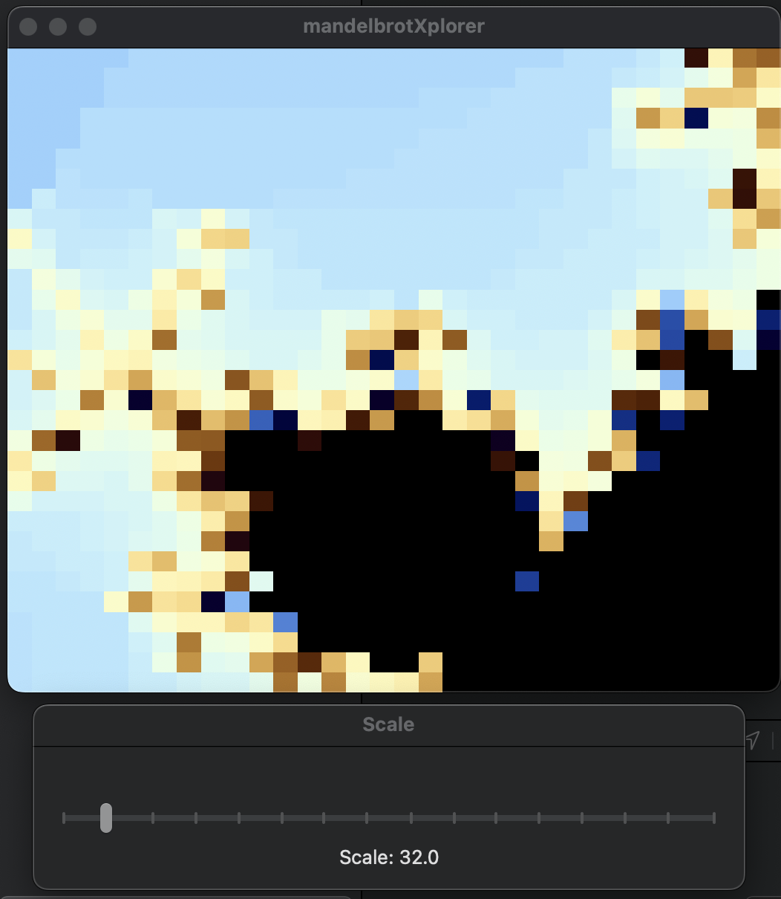

# Swift Concurrency Test - Mandelbrot Set

This app is a test of using Swift's concurrency features to render a mandelbrot set to a given scale.

This project has a couple of interesting features:

- Separate window for the scale selection, designed using _nibs_
- MVVC architecture
- Extending Array to have a concurrent version of map
- Allowing cancellation of the concurrent map
- ComplexNumber class to represent complex numbers

Of course, this isn't particularly efficient code, and there's no way to move around or zoom into the mandelbrot set. So this is more just a test of the concurrency features of Swift whilst using MVVC on a slightly less trivial problem.

## Running the app

To run the app, you'll need to have Xcode installed. Then, just open the project and run it.

## Known issues

- There's no indication that a render is happening, so high scale values can make the app appear to be frozen.
- The main window doesn't go to the front when the project is run from xcode. Instead the scale window is presented.
- No documentation!!!
- No tests!!!

These may be worked on in the future, though happy for anyone to contribute.
